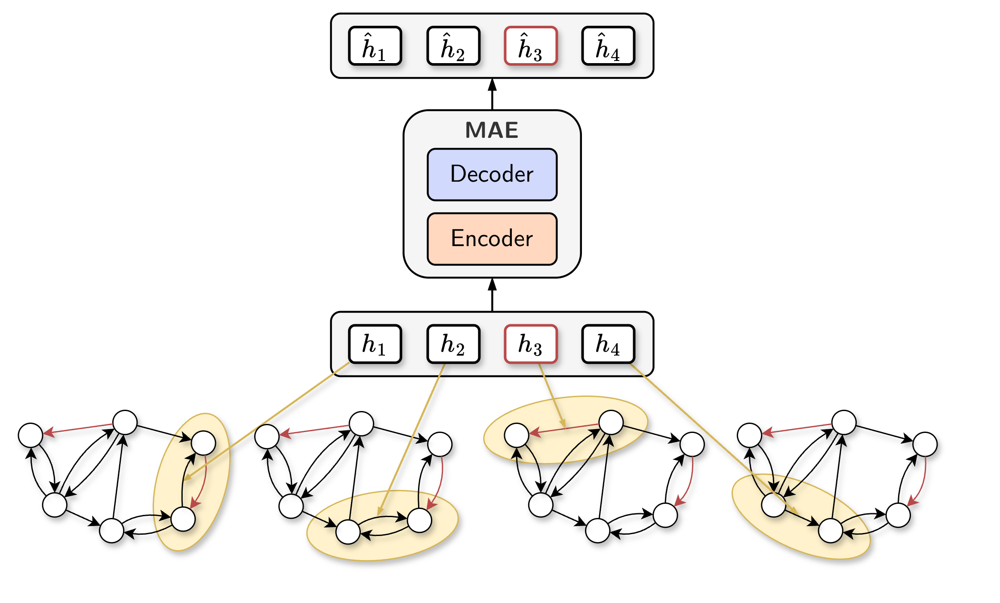

[](CHANGEME_ARXIV_URL) [](https://opensource.org/licenses/Apache-2.0)

# Self-Supervised Learning of Graph Representations for Network Intrusion Detection

_Lorenzo Guerra, Thomas Chapuis, Guillaume Duc, Pavlo Mozharovskyi, Van-Tam Nguyen_

This repository provides the official code and pretrained models for our paper, accepted at NeurIPS 2025.

<details>
<summary>Abstract</summary>
Detecting intrusions in network traffic is a challenging task, particularly under limited supervision and constantly evolving attack patterns. While recent works have leveraged graph neural networks for network intrusion detection, they often decouple representation learning from anomaly detection, limiting the utility of the embeddings for identifying attacks. We propose GraphIDS, a self-supervised intrusion detection model that unifies these two stages by learning local graph representations of normal communication patterns through a masked autoencoder. An inductive graph neural network embeds each flow with its local topological context to capture typical network behavior, while a Transformer-based encoder-decoder reconstructs these embeddings, implicitly learning global co-occurrence patterns via self-attention without requiring explicit positional information. During inference, flows with unusually high reconstruction errors are flagged as potential intrusions. This end-to-end framework ensures that embeddings are directly optimized for the downstream task, facilitating the recognition of malicious traffic. On diverse NetFlow benchmarks, GraphIDS achieves up to 99.98% PR-AUC and 99.61% macro F1-score, outperforming baselines by 5-25 percentage points.
</details>

<p align="center">
  
</p>

## Requirements

To install the requirements run this command:

```bash
conda env create -f environment.yml
```
To prepare the environment, activate the newly created conda environment and set the environment variables to allow reproducibility. To do so, run these commands:
```bash
conda activate pyg
export PYTORCH_CUDA_ALLOC_CONF=expandable_segments:True
export CUBLAS_WORKSPACE_CONFIG=:4096:8
```

We use Weights & Biases for experiment tracking. For review purposes, W&B is set to offline mode by default and no login is required. All logs will be stored locally. Optionally, you can enable online mode by passing the `--wandb` parameter.

The datasets can be downloaded from this website: https://staff.itee.uq.edu.au/marius/NIDS_datasets/

After downloading each dataset zip file, unzip it with the following command:

```bash
unzip -d <dataset_name> -j <filename>.zip
```

For example, for the NF-UNSW-NB15-v3 dataset:
```bash
unzip -d NF-UNSW-NB15-v3 -j f7546561558c07c5_NFV3DATA-A11964_A11964.zip
```

NOTE: The authors recently renamed the file for the NF-CSE-CIC-IDS2018-v2 and NF-CSE-CIC-IDS2018-v3 datasets as NF-CICIDS2018-v2 and NF-CICIDS2018-v3.\
To keep a consistent naming convention with the literature, the code expects the dataset directory and the dataset CSV file to be named as one of the 4 considered datasets: `NF-UNSW-NB15-v2`, `NF-UNSW-NB15-v3`, `NF-CSE-CIC-IDS2018-v2`, `NF-CSE-CIC-IDS2018-v3`.

## Training

To train GraphIDS, run this command:

```bash
python3 main.py --data_dir <data_dir> --config configs/<dataset_name>.yaml
```
`<data_dir>` should point to the directory containing all the datasets. The code expects the directory structure found in the zip files (i.e., each CSV file should be located at `<data_dir>/<dataset_name>/<dataset_name>.csv`). For example, for the following directory structure:
```tree
data/
└── NF-UNSW-NB15-v3
    ├── FurtherInformation.txt
    ├── NF-UNSW-NB15-v3.csv
    ├── NetFlow_v3_Features.csv
    ├── bag-info.txt
    ├── bagit.txt
    ├── manifest-sha1.txt
    └── tagmanifest-sha1.txt
configs/
└── NF-UNSW-NB15-v3.yaml
```
You should run:
```bash
python3 main.py --data_dir data/ --config configs/NF-UNSW-NB15-v3.yaml
```

To specify different training parameters, you can either modify the configuration file in the `configs/` directory, or provide all parameters using command-line arguments. The full list of possible arguments can be accessed by running the command:
```bash
python3 main.py --help
```

## Evaluation

By running the command above, the model would also be evaluated after training. However, to only evaluate the model from a saved checkpoint, run the following command:

```bash
python3 main.py --data_dir <data_dir> --config configs/<dataset_name>.yaml --checkpoint checkpoints/GraphIDS_<dataset_name>_<seed>.ckpt --test
```

## Pretrained Models

As the models are relatively lightweight, the saved checkpoints of the pretrained models can be found directly in this repository under the `pretrained/` directory. To test the pretrained models, run the following command:

```bash
python3 main.py --data_dir <data_dir> --config configs/<dataset_name>.yaml --checkpoint pretrained/GraphIDS_<dataset_name>.ckpt --test
```
Since the model predictions depend on feature normalization, our code automatically loads the MinMaxScaler from the `scalers/` directory. These scalers were fitted on the training data and must be used consistently for proper evaluation of pretrained models.

## Results

Our model achieves the following performance on the following datasets:

### [NF-UNSW-NB15-v3](https://rdm.uq.edu.au/files/abd2f5d8-e268-4ff0-84fb-f2f7b3ca3e8f)

| Model name         |  Macro F1-score  |  Macro PR-AUC  |
| ------------------ | ---------------- | -------------- |
| GraphIDS           |      99.61%      |      99.98%    |

### [NF-CSE-CIC-IDS2018-v3](https://rdm.uq.edu.au/files/4ac221b1-6bd6-42b1-bdf7-03f4fc7efb22)

| Model name         |  Macro F1-score  |  Macro PR-AUC  |
| ------------------ | ---------------- | -------------- |
| GraphIDS           |      94.47%      |      88.19%    |

### [NF-UNSW-NB15-v2](https://rdm.uq.edu.au/files/8c6e2a00-ef9c-11ed-827d-e762de186848)

| Model name         |  Macro F1-score  |  Macro PR-AUC  |
| ------------------ | ---------------- | -------------- |
| GraphIDS           |      92.64%      |      81.16%    |

### [NF-CSE-CIC-IDS2018-v2](https://rdm.uq.edu.au/files/ce5161d0-ef9c-11ed-827d-e762de186848)

| Model name         |  Macro F1-score  |  Macro PR-AUC  |
| ------------------ | ---------------- | -------------- |
| GraphIDS           |      94.31%      |      92.01%    |

The results are averaged over multiple seeds. 

## Citation

If you find this work useful in your research, please consider citing our paper:

```bibtex
@inproceedings{guerra2025self,
  title={Self-Supervised Learning of Graph Representations for Network Intrusion Detection},
  author={Guerra, Lorenzo and Chapuis, Thomas and Duc, Guillaume and Mozharovskyi, Pavlo and Nguyen, Van-Tam},
  booktitle={Thirty-ninth Conference on Neural Information Processing Systems},
  year={2025},
  url={CHANGEME_LINK_TO_PAPER}
}
```

## License

All original components of this repository are licensed under the [Apache License 2.0](./LICENSE). Third-party components are used in compliance with their respective licenses.

### Third-Party Code
- `baselines/Anomal-E/`: Contains modified components from the [Anomal-E repository](https://github.com/waimorris/Anomal-E/), which is licensed under the Apache License 2.0.

- `baselines/SAFE/`: Due to the absence of a formal license in the original SAFE repository, we do **not redistribute its code**. This directory contains instructions and tooling to apply our changes externally. Users must manually download the original SAFE code from its source (https://github.com/ElvinLit/SAFE/). We have received explicit permission from the SAFE authors to use their code for research purposes.
